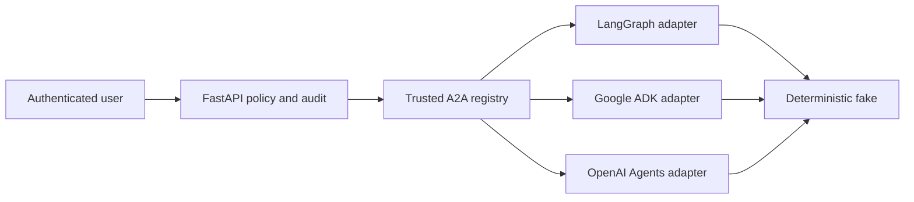

# A2A agent registry

Phase 11 defines three trusted capabilities:

| Agent | Runtime | Skill | Product boundary |
|---|---|---|---|
| `langgraph-core` | LangGraph | `job-analysis.v1` | Evidence-grounded job analysis |
| `google-adk-research` | Google ADK | `company-research.v1` | Supplied/approved-source research |
| `openai-interview` | OpenAI Agents | `interview-simulation.v1` | Interview practice |

Agent Cards are descriptions, not permissions. The API derives identity from the local
development session, evaluates `analysis.run` against an owned tenant resource, then the
registry rechecks agent/skill allowlists. Task lookup keys include tenant, actor, and task
ID so a foreign ID returns the same not-found result as an absent one.

Local lifecycle states are `submitted`, `working`, and one of `completed`, `failed`, or
`canceled`. Duplicate identical submissions return the original task; conflicting reuse
fails. A timeout or unavailable runtime becomes a stable error and failed task. There is
no silent rerouting. Payloads are bounded string maps and tests use only synthetic IDs.

The advertised local URLs represent future official JSON-RPC service endpoints. They are
not mounted in Phase 11. Before production, implement official SDK servers and clients,
workload identity, signed/allowlisted discovery, durable storage, revocation, rate limits,
retention/deletion, and trace propagation; then threat-model and load-test them.
