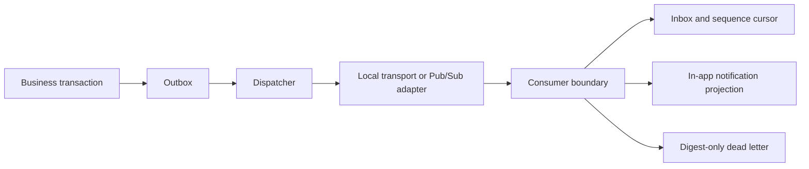

# Event delivery and notification boundary

## Ownership and flow

The source aggregate remains authoritative. Events contain opaque references, never resume,
job-description, prompt, or generated prose. A publish acknowledgement means transport
accepted the message, not that a consumer completed business processing.

## Delivery rules

- Event schema and supported types are explicit and unknown fields fail closed.
- Duplicate event IDs are harmless for each named consumer.
- Sequence gaps retry up to three deliveries, then enter dead letter.
- A stale sequence follows the same bounded policy; it never mutates projection state.
- Invalid bytes retain only a SHA-256 digest, not the untrusted payload.
- Replay is explicit and possible only for a validated retained event.
- Notifications are tenant-and-actor scoped and preferences are checked at projection time.

The process-local store proves semantics, not crash durability. Production requires atomic
PostgreSQL tables and transactions, leasing/concurrent-dispatch controls, authenticated
subscriber identities, metrics, runbooks, retention/deletion propagation, and restore tests.
