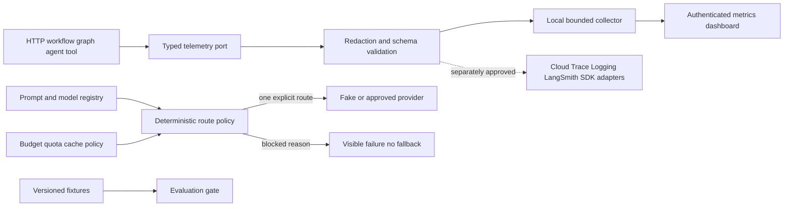

# Observability, evaluation, and routing architecture

## Telemetry schema

Events carry pseudonymous tenant/actor/correlation/operation identifiers, operation kind/name,
outcome, duration, provider/model/prompt versions, token counts, estimated CHF cost and bounded
opaque attributes. They cannot carry prompts, job/resume/draft text, model responses, email,
secrets, arbitrary exception messages or hidden reasoning.

HTTP middleware currently emits local request metrics. Existing LangGraph, ADK and OpenAI
component telemetry remains bounded and the common schema is the migration target. Production
trace context propagation and exporters require deployment infrastructure and are not claimed.

## Export policy

| Destination | Phase 15 state | Content |
|---|---|---|
| Local collector | Enabled, bounded memory | Metadata only |
| OpenTelemetry API spans | Local no-op/export disabled | Metadata attributes only |
| Cloud Trace/Logging | Adapter/config boundary | `NO_CONTENT`; disabled |
| ADK prompt-response GCS/BigQuery | Disabled independently | Full content prohibited |
| BigQuery Agent Analytics | Schema only | Metadata-only proposed fields |
| LangSmith | Adapter boundary | Disabled |
| OpenAI SDK tracing | Disabled | No export |

## Routing and spending

The request names one route. Policy either allows it or returns a stable reason. It never loops
over candidates, treats provider outage as permission to switch, or lets an LLM decide privacy/
cost. Estimate, approval and remaining tenant budget are checked before reservation. Local
ledgers demonstrate semantics; production needs an atomic durable ledger and reconciliation.
