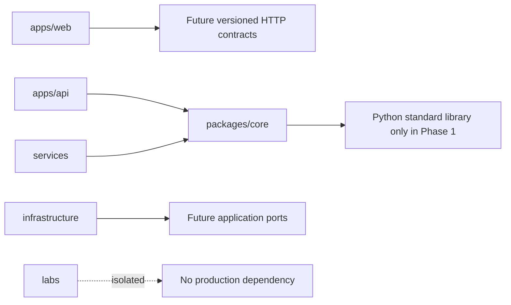

# Repository Structure

| Path | Responsibility |
|---|---|
| `apps/api/` | FastAPI HTTP adapter package; no product endpoint in Phase 1 |
| `apps/web/` | Next.js browser application and frontend tests |
| `packages/core/` | Framework-independent domain-safe Python package |
| `services/` | Future independently deployed ADK/OpenAI specialist services |
| `infrastructure/` | Local and future cloud infrastructure definitions |
| `labs/` | Isolated comparison experiments, never production imports |
| `tests/unit/` | Fast deterministic package and configuration tests |
| `tests/architecture/` | Dependency-direction enforcement |
| `security/` | Local SAST rules and later security policy configuration |
| `scripts/` | Typed repository validation and developer automation |
| `tools/documentation/` | Pinned Markdown, link, and Mermaid validators |
| `docs/` | Durable product, architecture, security, learning, and review record |

## Dependency direction

The Python environment is shared for reproducibility, so the architecture test—not
the package manager—prevents forbidden outward imports from `packages/core`.
