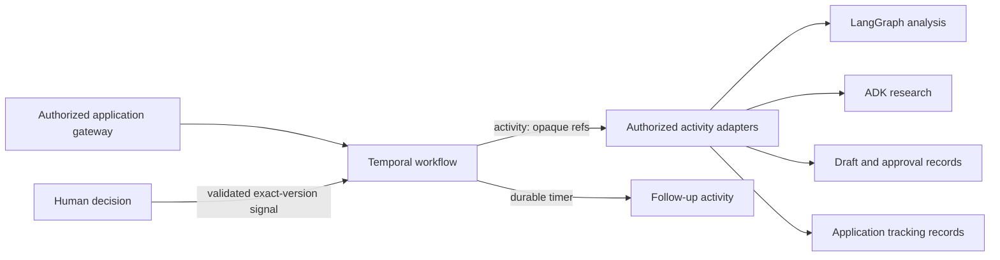

# Temporal workflow state and recovery

The Phase 12 process separates state owners deliberately:

| State | Owner | Example | Source of truth? |
|---|---|---|---|
| Workflow state/history | Temporal | Current stage, timer, received signal | Process progress only |
| Graph state/checkpoint | LangGraph | Analysis node outputs and routing | Bounded analysis run only |
| Application state | PostgreSQL | Draft, approval, application milestone | Yes, for business records |
| Agent session | ADK/OpenAI service | Specialist conversation/session | No |
| Audit history | Audit store | Allowed/denied action metadata | Security evidence |
| Fake activity ledger | Local tests | Synthetic idempotent effects | No; test double only |

Workflow code must replay to the same commands for the same event history. It therefore
cannot read a database, call a model, use wall-clock time/randomness, access the network or
filesystem, or authorize a caller. Those operations occur in retryable activities or the
authenticated application gateway.

Retry repeats an activity attempt. Replay rebuilds workflow state from history without
repeating completed effects. Resume continues after a worker returns. Recovery is the
overall restoration behavior. Compensation is an explicit semantic reversal and is not a
database rollback. Fallback selects a different behavior/provider and remains forbidden
unless explicitly approved and disclosed.

The local worker disables sticky caching in the restart test so a new worker must rebuild
state from server history immediately. A replay test then checks that the current workflow
implementation can consume the completed history without non-determinism.
