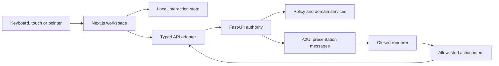

# Web experience architecture

The browser owns presentation state only. It may choose a visible panel, preserve an input
during a retry, or display a loading state. It cannot assert a tenant, permission, approval
or workflow transition; those remain server decisions.

The dashboard exposes overview, profile/evidence, job workspace, cited results, workflow
activity, draft review, interview lab status, application tracking, notifications and audit.
Panels backed only by local fixtures are labeled and consequential actions remain unavailable.

Accessibility is structural: landmarks, heading order, skip navigation, native controls,
visible focus, live regions, text status in addition to color, reduced-motion support and
layouts that collapse without horizontal page scrolling. The English copy is isolated from
business rules so message catalogs can replace it later without changing domain contracts.
