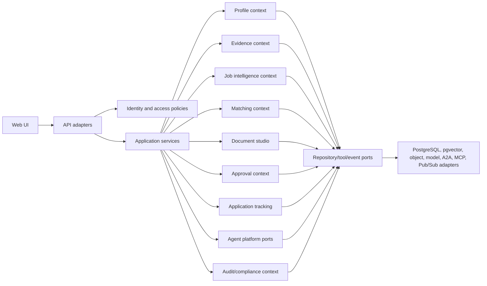

# Primary Application Components

```mermaid
flowchart LR
    UI[Web UI] --> API[API adapters]
    API --> AUTH[Identity and access policies]
    API --> APP[Application services]
    APP --> PROFILE[Profile context]
    APP --> EVIDENCE[Evidence context]
    APP --> JOBS[Job intelligence context]
    APP --> MATCH[Matching context]
    APP --> DOCS[Document studio]
    APP --> APPROVAL[Approval context]
    APP --> TRACK[Application tracking]
    APP --> AGENT[Agent platform ports]
    APP --> AUDIT[Audit/compliance context]
    PROFILE --> PORTS[Repository/tool/event ports]
    EVIDENCE --> PORTS
    JOBS --> PORTS
    MATCH --> PORTS
    DOCS --> PORTS
    APPROVAL --> PORTS
    TRACK --> PORTS
    AGENT --> PORTS
    AUDIT --> PORTS
    PORTS --> ADAPTERS[PostgreSQL, pgvector, object, model, A2A, MCP, Pub/Sub adapters]
```

Dependency direction points inward: adapters depend on ports and contracts;
domain policy never imports provider SDKs.
