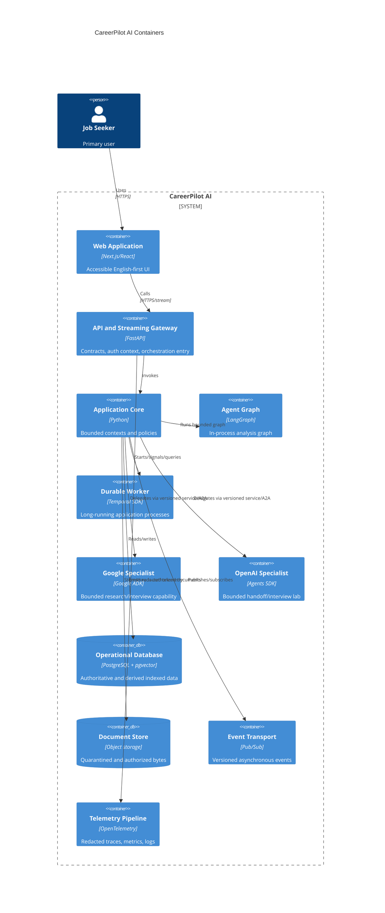

# Container Diagram

```mermaid
C4Container
    title CareerPilot AI Containers
    Person(user, "Job Seeker", "Primary user")
    System_Boundary(cp, "CareerPilot AI") {
        Container(web, "Web Application", "Next.js/React", "Accessible English-first UI")
        Container(api, "API and Streaming Gateway", "FastAPI", "Contracts, auth context, orchestration entry")
        Container(core, "Application Core", "Python", "Bounded contexts and policies")
        Container(graph, "Agent Graph", "LangGraph", "In-process analysis graph")
        Container(worker, "Durable Worker", "Temporal SDK", "Long-running application processes")
        Container(adk, "Google Specialist", "Google ADK", "Bounded research/interview capability")
        Container(openai, "OpenAI Specialist", "Agents SDK", "Bounded handoff/interview lab")
        ContainerDb(db, "Operational Database", "PostgreSQL + pgvector", "Authoritative and derived indexed data")
        ContainerDb(objects, "Document Store", "Object storage", "Quarantined and authorized bytes")
        Container(events, "Event Transport", "Pub/Sub", "Versioned asynchronous events")
        Container(telemetry, "Telemetry Pipeline", "OpenTelemetry", "Redacted traces, metrics, logs")
    }
    Rel(user, web, "Uses", "HTTPS")
    Rel(web, api, "Calls", "HTTPS/stream")
    Rel(api, core, "Invokes")
    Rel(core, db, "Reads/writes")
    Rel(core, objects, "Stores/reads authorized documents")
    Rel(core, graph, "Runs bounded graph")
    Rel(core, worker, "Starts/signals/queries")
    Rel(core, adk, "Delegates via versioned service/A2A")
    Rel(core, openai, "Delegates via versioned service/A2A")
    Rel(core, events, "Publishes/subscribes")
    Rel(api, telemetry, "Emits redacted telemetry")
```
