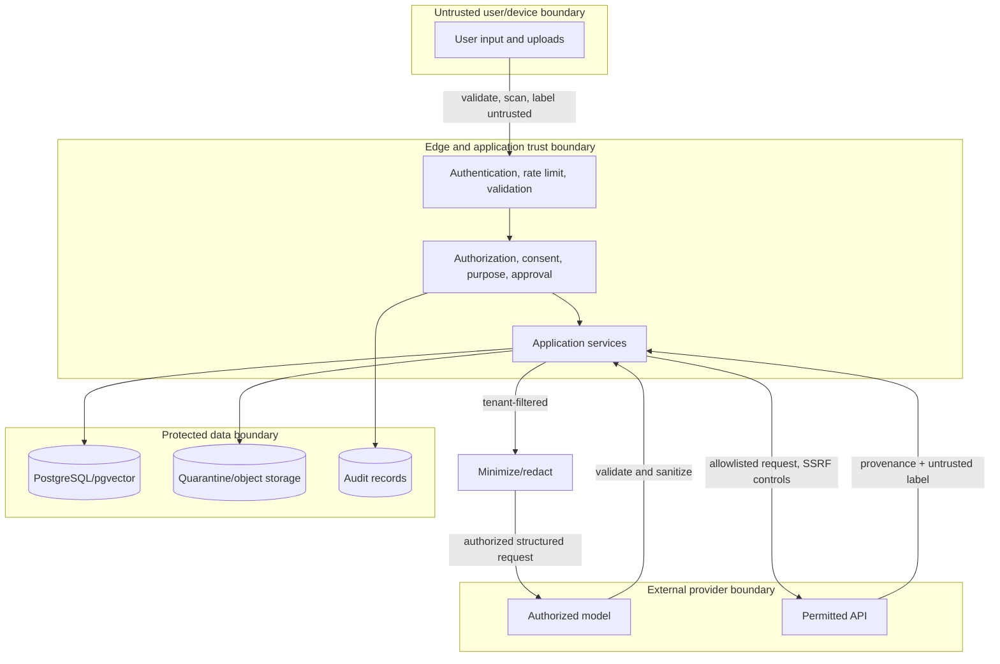

# Data Flow and Trust Boundaries

```mermaid
flowchart TB
    subgraph TB1[Untrusted user/device boundary]
        USER[User input and uploads]
    end
    subgraph TB2[Edge and application trust boundary]
        EDGE[Authentication, rate limit, validation]
        POLICY[Authorization, consent, purpose, approval]
        CORE[Application services]
    end
    subgraph TB3[Protected data boundary]
        DB[(PostgreSQL/pgvector)]
        OBJ[(Quarantine/object storage)]
        AUDIT[(Audit records)]
    end
    subgraph TB4[External provider boundary]
        MODEL[Authorized model]
        SOURCE[Permitted API]
    end
    USER -->|validate, scan, label untrusted| EDGE
    EDGE --> POLICY
    POLICY --> CORE
    CORE -->|tenant-filtered|minimize[Minimize/redact]
    minimize -->|authorized structured request| MODEL
    MODEL -->|validate and sanitize| CORE
    CORE -->|allowlisted request, SSRF controls| SOURCE
    SOURCE -->|provenance + untrusted label| CORE
    CORE --> DB
    CORE --> OBJ
    POLICY --> AUDIT
```

No external response is executable instruction. Retrieved documents remain
untrusted data even when supplied by an authenticated user.
