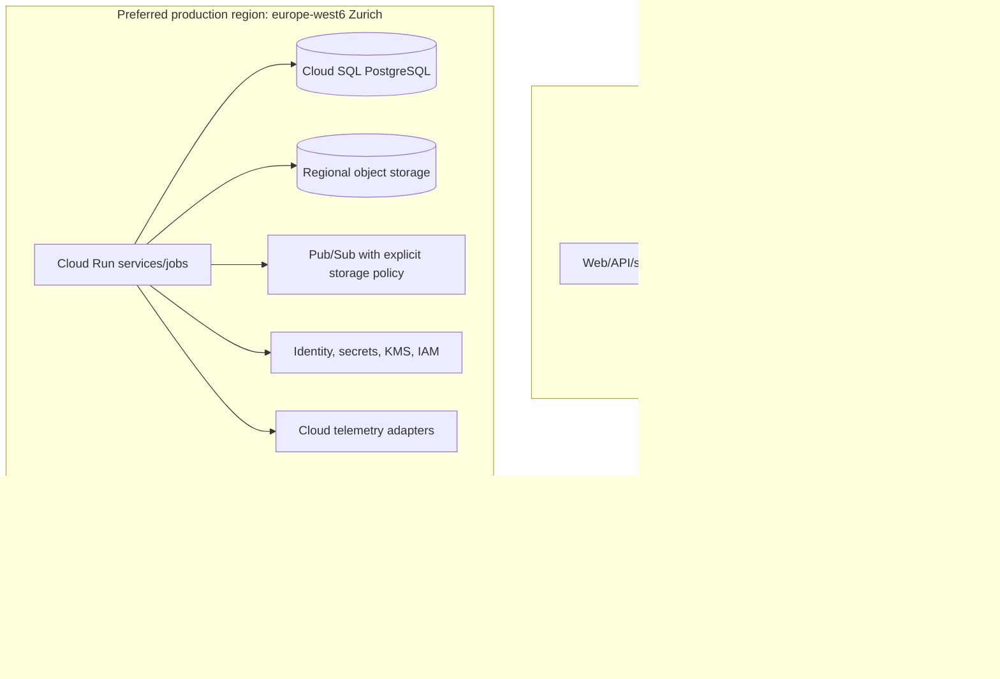

# Deployment Baseline

```mermaid
flowchart TB
    subgraph LOCAL[Local / CI — CHF 0]
        LWEB[Web/API/services]
        LDB[(Local PostgreSQL + pgvector)]
        LFAKE[Fake models and service adapters]
        LOBS[Local telemetry collector]
    end
    subgraph ZRH[Preferred production region: europe-west6 Zurich]
        RUN[Cloud Run services/jobs]
        SQL[(Cloud SQL PostgreSQL)]
        STORE[(Regional object storage)]
        PUB[Pub/Sub with explicit storage policy]
        SEC[Identity, secrets, KMS, IAM]
        OBS[Cloud telemetry adapters]
    end
    subgraph EU[Documented EU fallback only]
        FALLBACK[Unavailable-service exception]
    end
    LWEB --> LDB
    LWEB --> LFAKE
    LWEB --> LOBS
    RUN --> SQL
    RUN --> STORE
    RUN --> PUB
    RUN --> SEC
    RUN --> OBS
    ZRH -. availability/residency/security/privacy/latency/cost review .-> EU
```

Phase 0 creates no cloud resources. Staging and production require separate
identity, configuration, data, and explicit cost approval.
