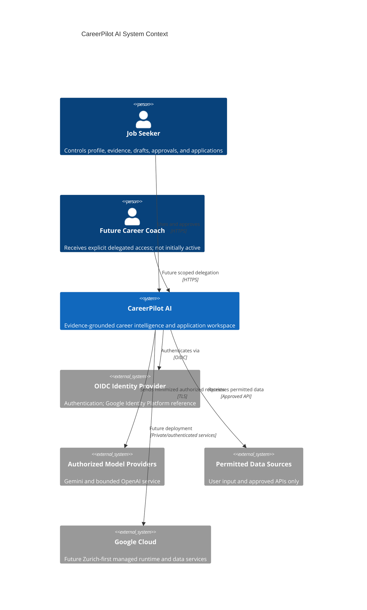

# System Context Diagram

Trust assumption: every external actor, document, provider response, network, and
service identity is untrusted until authenticated, authorized, validated, and
bounded by purpose.
