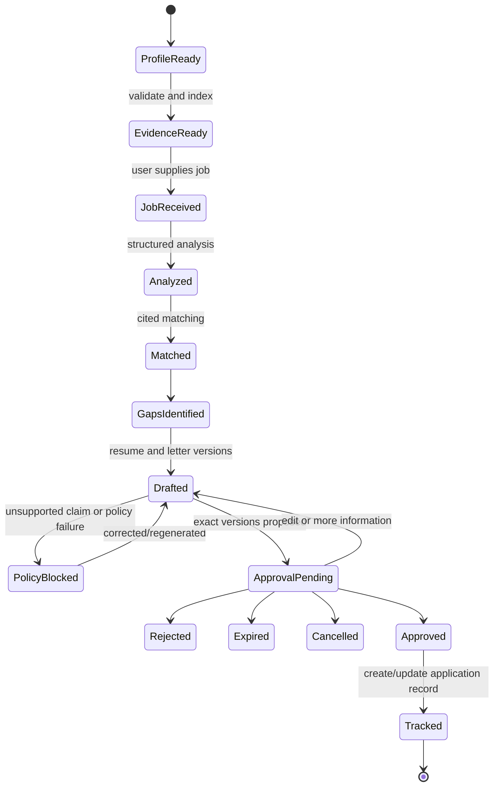

# Main Workflow Diagram

```mermaid
stateDiagram-v2
    [*] --> ProfileReady
    ProfileReady --> EvidenceReady: validate and index
    EvidenceReady --> JobReceived: user supplies job
    JobReceived --> Analyzed: structured analysis
    Analyzed --> Matched: cited matching
    Matched --> GapsIdentified
    GapsIdentified --> Drafted: resume and letter versions
    Drafted --> PolicyBlocked: unsupported claim or policy failure
    PolicyBlocked --> Drafted: corrected/regenerated
    Drafted --> ApprovalPending: exact versions proposed
    ApprovalPending --> Drafted: edit or more information
    ApprovalPending --> Rejected
    ApprovalPending --> Expired
    ApprovalPending --> Cancelled
    ApprovalPending --> Approved
    Approved --> Tracked: create/update application record
    Tracked --> [*]
```

LangGraph owns bounded analysis/drafting subgraphs. Temporal later owns the
long-running process, durable waits, schedules, retry, cancellation, and recovery.
