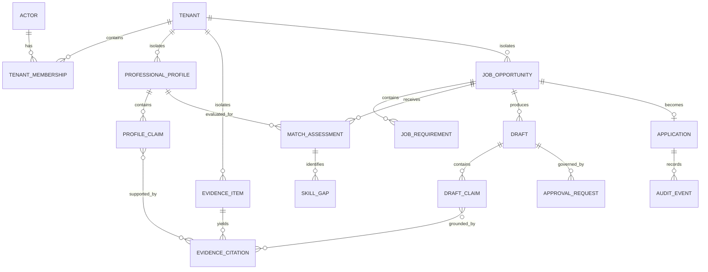

# Initial Domain Model

## Bounded contexts

| Context | Owns | Does not own |
|---|---|---|
| Identity and Access | Actor identity references, tenant membership, roles, policy decisions | Provider credentials or career data |
| Professional Profile | Confirmed skills, experience, education, profile versions | Generated job-specific drafts |
| Evidence Library | Evidence metadata, provenance, processing lifecycle, citations | Authentication or model routing |
| Job Intelligence | User-supplied job/company inputs and structured requirements | Candidate evidence |
| Matching | Evidence-backed matches, gaps, confidence, explanations | Source profile mutation |
| Document Studio | Versioned resume and letter drafts, claim-evidence links | External submission |
| Approval | Proposals, decisions, expiry, edits, resumable gates | Hidden model reasoning |
| Application Tracking | Application status, milestones, follow-ups | Email delivery by default |
| Agent Platform | Graph runs, agent contracts, tools, evaluations, provider policy | Authoritative user/business records |
| Audit and Compliance | Append-oriented audit facts, privacy requests, retention execution | Agent memory |

## Core relationships

## State ownership

- PostgreSQL owns authoritative application state and audit references.
- Object storage owns encrypted document bytes under evidence lifecycle policy.
- pgvector owns derived indexes, never the only copy of a fact.
- LangGraph checkpoints own resumable graph state, not business truth.
- Temporal owns durable business-process progress, timers, signals, and retries.
- Agent sessions own bounded conversational context.
- Memory is opt-in, purpose-limited, and never substitutes for profile evidence.
- Audit history is append-oriented evidence and cannot be rewritten as memory.

## Invariants

1. Every tenant-owned aggregate carries a tenant identifier.
2. Repository queries require an authorized tenant context; caller-provided tenant
   identifiers alone are insufficient authority.
3. A material draft claim is supported, marked as a suggestion, or blocked.
4. Approved artifact versions are immutable; edits create new versions.
5. Derived data follows source authorization, retention, correction, and deletion.
6. Approval decisions bind to exact proposal and artifact versions.
